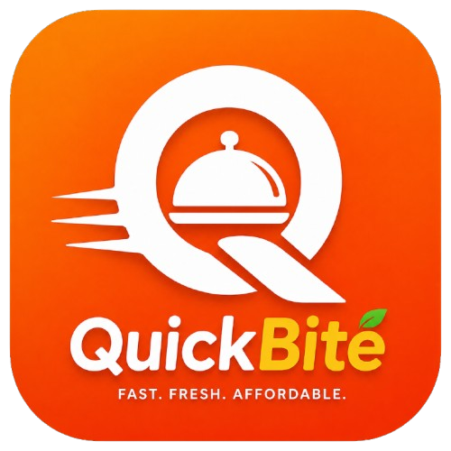

<div align="center">
  
  <h1>🍽️ Campus Grub Hub</h1>
</div>

> **Your campus food ordering platform** — Order from campus restaurants, join group orders, track deliveries in real-time, and schedule meals ahead. Built for students, by students.


---

## 📖 Table of Contents

- [Overview](#overview)
- [Features](#features)
- [Tech Stack](#tech-stack)
- [Architecture](#architecture)
- [Project Structure](#project-structure)
- [Getting Started](#getting-started)
- [Environment Variables](#environment-variables)
- [Database Schema](#database-schema)
- [Available Scripts](#available-scripts)
- [Deployment](#deployment)
- [Testing](#testing)
- [Contributing](#contributing)
- [License](#license)

---

## 🎯 Overview

**Campus Grub Hub** is a full-featured food ordering platform designed specifically for university campuses. It solves real student problems:

- 🍕 **Late-night hunger?** Browse open restaurants and order to your hostel
- 👥 **Group ordering?** Split bills with roommates automatically
- ⏰ **Busy schedule?** Schedule meals ahead for exam weeks
- 📍 **Lost delivery?** Track your order live on a map with real-time updates

The app is built as a **Progressive Web App (PWA)** with a mobile-first design, ensuring it works seamlessly on any device — from budget Android phones to desktop browsers.

---

## ✨ Features

### Core User Features

| Feature | Description |
|---------|-------------|
| 🏠 **Dashboard** | AI-style meal recommendations, category filters, quick reorder |
| 🍽️ **Restaurant Browse** | Full menu browsing with dietary tags, pricing, ratings |
| 🛒 **Smart Cart** | Add/remove items, customize orders, apply coupons |
| 📍 **Live Tracking** | Real-time order tracking with rider location on map |
| 👥 **Group Orders** | Create/share invite links, split bills, item-level ownership |
| ⏰ **Scheduled Orders** | Pre-order meals for specific delivery times |
| 📋 **Order History** | View past orders with reorder functionality |
| 👤 **User Profile** | Manage contact info, delivery addresses, preferences |
| 🔍 **Search** | Find restaurants by cuisine, dish name, or tags |
| 🌓 **Dark Mode** | System-synced theme with manual toggle |

### Technical Highlights

- 🔐 **Authentication** via Supabase Auth with email/phone OTP
- 💾 **Offline-first** architecture with localStorage persistence
- 🗺️ **Geolocation** support for accurate distance + ETA calculation
- 📱 **Responsive** design with desktop sidebar + mobile bottom nav
- ♿ **Accessible** UI components following WCAG guidelines
- 🧪 **Type-safe** codebase with full TypeScript coverage
- 🧩 **Modular** component architecture for easy scaling

---

## 🛠️ Tech Stack

### Frontend

```
┌─────────────────────────────────────────────────────────────┐
│  React 18.3.1           │  Component UI library             │
│  TypeScript 5.8.3       │  Type safety & DX                 │
│  Vite 5.4.19            │  Blazing-fast build tool          │
│  React Router 6.30.1    │  Client-side routing              │
│  TanStack Query 5.83.0  │  Server-state management          │
└─────────────────────────────────────────────────────────────┘
```

### UI & Styling

```
┌─────────────────────────────────────────────────────────────┐
│  Tailwind CSS 3.4.17    │  Utility-first CSS framework      │
│  shadcn/ui              │  Beautiful, accessible components │
│  Radix UI               │  Headless primitive components    │
│  Lucide React           │  Clean, consistent icon set       │
│  Embla Carousel         │  Touch-friendly carousel          │
│  Recharts 2.15.4        │  Data visualization charts        │
└─────────────────────────────────────────────────────────────┘
```

### Backend & Services

```
┌─────────────────────────────────────────────────────────────┐
│  Supabase               │  PostgreSQL + Auth + RLS          │
│  Groq API               │  AI-powered recommendations       │
│  Razorpay               │  Payment processing (India)       │
│  Leaflet + React-Leaflet│  Interactive maps                 │
│  date-fns               │  Lightweight date utilities       │
└─────────────────────────────────────────────────────────────┘
```

### Development & Quality

```
┌─────────────────────────────────────────────────────────────┐
│  Vitest 3.2.4           │  Unit & component testing         │
│  Testing Library        │  React component testing          │
│  ESLint 9.32.0          │  Code quality & standards         │
│  TypeScript ESLint      │  TS-specific linting rules        │
│  PostCSS 8.5.6          │  CSS transformation pipeline      │
└─────────────────────────────────────────────────────────────┘
```

---

## 🏗️ Architecture

### Application Flow

```
┌─────────────┐     ┌──────────────┐     ┌─────────────┐
│   User      │────▶│  React App   │────▶│  Supabase   │
│   Browser   │     │  (Vite SPA)  │     │  Backend    │
└─────────────┘     └──────────────┘     └─────────────┘
                           │
                           ▼
                    ┌──────────────┐
                    │  localStorage │
                    │  (Persistence)│
                    └──────────────┘
```

### State Management

| Layer | Technology | Purpose |
|-------|------------|---------|
| **Server State** | TanStack Query | API caching, background sync |
| **Client State** | React Context | Cart, user preferences |
| **Local Storage** | Custom stores | Offline persistence |
| **Auth State** | Supabase Auth | Session management |

### Data Stores

```typescript
// localStorage keys
'bb:group:*'       // Group order data
'bb:group:active'  // Active group session
'bb:active-order'  // Current order tracking
'bb:geo'           // Cached geolocation
```

---

## 📁 Project Structure

```
campus-grub-hub/
├── 📂 public/                  # Static assets (favicons, robots.txt)
├── 📂 src/
│   ├── 📂 components/
│   │   ├── 📂 ui/             # shadcn/ui primitives (50+ components)
│   │   ├── AppShell.tsx       # Main layout wrapper
│   │   ├── NavLink.tsx        # Navigation helper
│   │   ├── Preloader.tsx      # App loading animation
│   │   └── RestaurantCard.tsx # Restaurant listing card
│   │
│   ├── 📂 context/
│   │   └── CartContext.tsx    # Global cart state management
│   │
│   ├── 📂 data/
│   │   └── mock.ts            # Mock restaurant/menu data
│   │
│   ├── 📂 hooks/
│   │   ├── useGeolocation.ts  # Browser geolocation hook
│   │   ├── useOrderProgress.ts# Order timeline hook
│   │   ├── use-mobile.tsx     # Responsive breakpoint detection
│   │   └── use-toast.ts       # Toast notification helper
│   │
│   ├── 📂 lib/
│   │   ├── supabase.ts        # Supabase client initialization
│   │   ├── groupStore.ts      # Group order localStorage store
│   │   ├── orderStore.ts      # Order tracking store
│   │   └── utils.ts           # CN helper, formatters
│   │
│   ├── 📂 pages/
│   │   ├── Index.tsx          # Home dashboard
│   │   ├── Login.tsx          # Auth screen
│   │   ├── EditProfile.tsx    # Profile editor
│   │   ├── Restaurant.tsx     # Restaurant detail + menu
│   │   ├── Cart.tsx           # Cart + checkout
│   │   ├── Checkout.tsx       # Payment flow
│   │   ├── OrderTracking.tsx  # Live order status
│   │   ├── RecentOrders.tsx   # Order history
│   │   ├── GroupOrder.tsx     # Group ordering flow
│   │   ├── Search.tsx         # Search restaurants/dishes
│   │   ├── Profile.tsx        # User profile view
│   │   ├── Scheduled.tsx      # Scheduled orders
│   │   └── NotFound.tsx       # 404 page
│   │
│   ├── 📂 test/
│   │   ├── example.test.ts    # Sample unit test
│   │   └── setup.ts           # Test configuration
│   │
│   ├── App.tsx                # Root component + routing
│   ├── App.css                # Global styles
│   ├── index.css              # Tailwind base + utilities
│   └── main.tsx               # Entry point
│
├── 📂 supabase/                # Supabase migrations + functions
├── 📂 node_modules/            # Dependencies
│
├── package.json               # Project manifest + scripts
├── tsconfig.json              # TypeScript configuration
├── vite.config.ts             # Vite build configuration
├── tailwind.config.ts         # Tailwind customization
├── eslint.config.js           # ESLint rules
├── vitest.config.ts           # Vitest test configuration
├── .env.example               # Environment variable template
└── README.md                  # This file
```

---

## 🚀 Getting Started

### Prerequisites

Ensure you have the following installed:

```bash
# Check versions
node --version    # Required: Node.js 18+
npm --version     # Required: npm 9+
git --version     # Optional: Git for version control
```

### Installation

```bash
# 1. Clone the repository
git clone https://github.com/your-org/campus-grub-hub.git
cd campus-grub-hub

# 2. Install dependencies
npm install

# 3. Copy environment variables
cp .env.example .env

# 4. Configure your environment variables (see below)
```

### Configuration

Edit `.env` with your credentials:

```bash
# Supabase (Required)
VITE_SUPABASE_URL=https://your-project.supabase.co
VITE_SUPABASE_ANON_KEY=your-anon-key

# Groq AI (Required for AI features)
VITE_GROQ_API_KEY=your-groq-api-key

# Razorpay (Required for payments)
VITE_RAZORPAY_KEY_ID=rzp_test_your-key-id
```

> 🔑 **Get your keys:**
> - Supabase: [supabase.com](https://supabase.com/dashboard)
> - Groq: [console.groq.com/keys](https://console.groq.com/keys)
> - Razorpay: [dashboard.razorpay.com](https://dashboard.razorpay.com/)

### Running the App

```bash
# Development server (hot reload)
npm run dev

# Production build
npm run build

# Preview production build locally
npm run preview

# Run tests
npm run test

# Lint code
npm run lint
```

The development server runs at `http://localhost:8080` (configurable in `vite.config.ts`).

---

## 🗄️ Database Schema

### Supabase Tables

The application uses the following Supabase schema:

```sql
-- Users table (auto-created on signup)
CREATE TABLE public.users (
  id UUID PRIMARY KEY,
  name TEXT NOT NULL,
  email TEXT NOT NULL,
  phone TEXT NOT NULL,
  created_at TIMESTAMPTZ DEFAULT NOW(),
  updated_at TIMESTAMPTZ DEFAULT NOW()
);

-- Row Level Security enabled
ALTER TABLE public.users ENABLE ROW LEVEL SECURITY;

-- Policies: Users can only access their own data
CREATE POLICY "Enable users to read own profile"
  ON public.users FOR SELECT
  USING (auth.uid() = id);

CREATE POLICY "Enable users to update own profile"
  ON public.users FOR UPDATE
  USING (auth.uid() = id);

CREATE POLICY "Enable insert for authenticated users"
  ON public.users FOR INSERT
  WITH CHECK (auth.uid() = id);
```

### Triggers

```sql
-- Auto-create user profile on signup
CREATE TRIGGER on_auth_user_created
  AFTER INSERT ON auth.users
  FOR EACH ROW
  EXECUTE FUNCTION public.handle_new_user();
```

Full schema available in `supabase-schema.sql`.

---

## 📜 Available Scripts

| Command | Description |
|---------|-------------|
| `npm run dev` | Start Vite development server with HMR |
| `npm run build` | Create optimized production build |
| `npm run build:dev` | Development-mode build (unminified) |
| `npm run preview` | Preview production build locally |
| `npm run lint` | Run ESLint on source files |
| `npm run test` | Run Vitest test suite once |
| `npm run test:watch` | Run tests in watch mode |

---

## 🌐 Deployment

### Deploy to Vercel

1. Push to GitHub/GitLab
2. Import project in [Vercel Dashboard](https://vercel.com)
3. Configure environment variables
4. Deploy

**Build Settings:**
- **Framework Preset:** Vite
- **Build Command:** `npm run build`
- **Output Directory:** `dist`
- **Install Command:** `npm install`

### Environment Variables (Production)

Set these in Vercel dashboard:

```
VITE_SUPABASE_URL
VITE_SUPABASE_ANON_KEY
VITE_GROQ_API_KEY
VITE_RAZORPAY_KEY_ID
```

---

## 🧪 Testing

```bash
# Run all tests
npm run test

# Watch mode (re-runs on file changes)
npm run test:watch

# Test with coverage (coming soon)
npm run test:coverage
```

Tests are written using **Vitest** and **React Testing Library**.

---

## 🤝 Contributing

Contributions are welcome! Here's how you can help:

1. Fork the repository
2. Create a feature branch (`git checkout -b feature/amazing-feature`)
3. Commit your changes (`git commit -m 'Add amazing feature'`)
4. Push to the branch (`git push origin feature/amazing-feature`)
5. Open a Pull Request

### Code Standards

- Follow ESLint rules
- Write TypeScript with strict mode
- Use functional components with hooks
- Write tests for new features
- Document complex logic

---

## 📄 License

This project is licensed under the MIT License — see the [LICENSE](LICENSE) file for details.

---

## 🙏 Acknowledgments

- Built with [Vite](https://vitejs.dev/) + [React](https://react.dev/)
- UI components from [shadcn/ui](https://ui.shadcn.com/)
- Icons by [Lucide](https://lucide.dev/)
- Maps powered by [Leaflet](https://leafletjs.com/)
- Backend by [Supabase](https://supabase.com/)
- Payments by [Razorpay](https://razorpay.com/)
- AI by [Groq](https://groq.com/)

---

## 📬 Contact

For questions, feedback, or support:

- **Project Link:** [GitHub Repository](https://github.com/your-org/campus-grub-hub)
- **Issues:** [Report a bug](https://github.com/your-org/campus-grub-hub/issues)

---

<p align="center">
  <strong>Made with ❤️ for campus foodies</strong>
</p>
